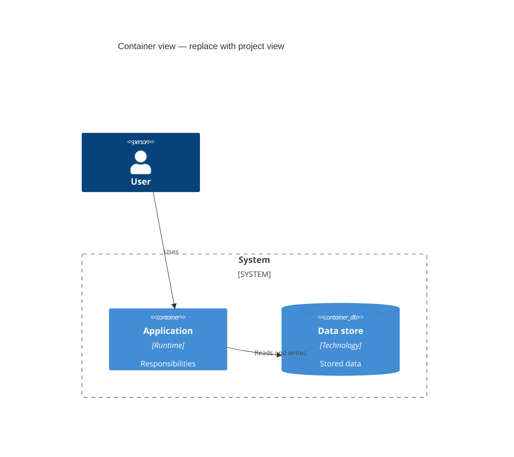

# Container view

**Abstraction:** deployable/runtime units and data stores
**Scope:** [system]
**Last reviewed:** YYYY-MM-DD

```mermaid
C4Container
    title Container view — replace with project view
    Person(user, "User")
    System_Boundary(system, "System") {
        Container(app, "Application", "Runtime", "Responsibilities")
        ContainerDb(data, "Data store", "Technology", "Stored data")
    }
    Rel(user, app, "Uses")
    Rel(app, data, "Reads and writes")
```

Explain runtime responsibilities, communication, and data ownership.
